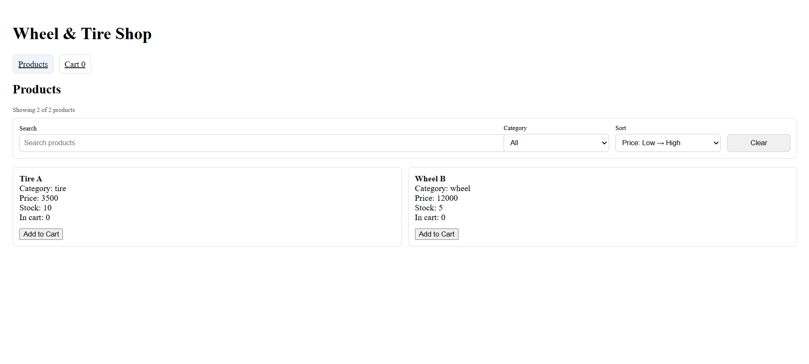
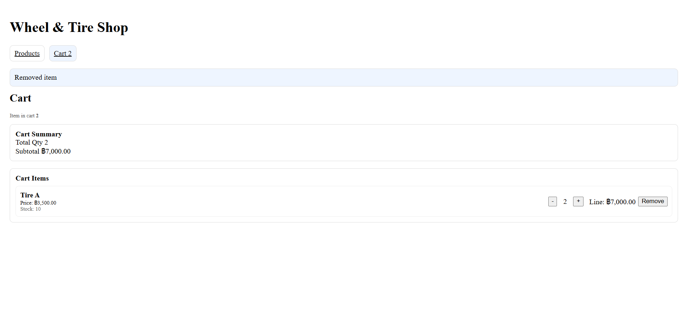
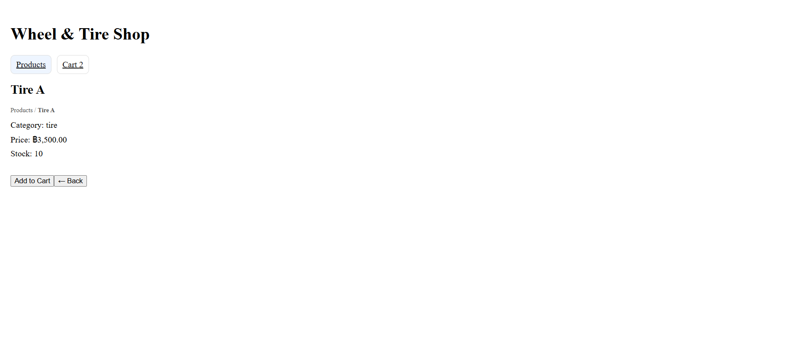

# Wheel & Tire Shop (React)

Live Demo: <PUT_YOUR_NETLIFY_URL_HERE>

## Features
- Product catalog with Search / Filter / Sort
- Product detail page (React Router)
- Cart: add / increase / decrease / remove
- Stock limit enforcement (cannot exceed stock)
- Toast notifications for cart actions
- Cart persistence with localStorage
- Responsive product grid

## Tech Stack
- React + Vite
- React Router
- JavaScript (ES6+)
- localStorage

## Project Structure
- `src/pages` — route pages (Products, Cart, Detail)
- `src/components` — reusable UI components
- `src/hooks` — custom hooks (`useProducts`)
- `src/utils` — business logic (cart utils, currency formatter)
- `src/api` — API layer (`getProducts`)
- `public` — mock data (`products.mock.json`) + SPA redirects (`_redirects`)

## Getting Started (Local)
```bash
npm install
npm run dev

```md id="https://wheel-tire-shop.netlify.app/products"
## 📸 Screenshots

### 🏠 Products Page


### 🛒 Cart & Checkout


### 🔍 Product Detail


## What I Built / Highlights
- Responsive product catalog with Search / Filter / Sort (derived state)
- Cart with immutable updates + stock enforcement
- React Router pages: Products, Cart, Product Detail
- Toast notifications + localStorage persistence
- Deployed to Netlify with SPA redirect for deep links